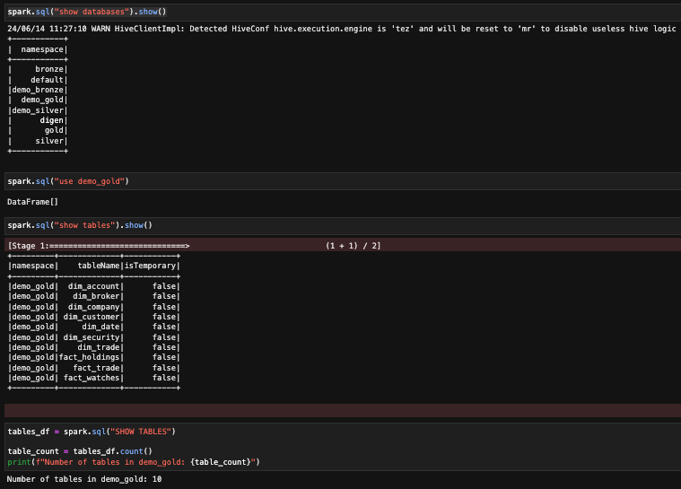
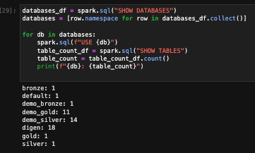

IMPORTANT ❗ ❗ ❗ Please remember to destroy all the resources after each work session. You can recreate infrastructure by creating new PR and merging it to master.


0. The goal of this phase is to create infrastructure, perform benchmarking/scalability tests of sample three-tier lakehouse solution and analyze the results using:
* [TPC-DI benchmark](https://www.tpc.org/tpcdi/)
* [dbt - data transformation tool](https://www.getdbt.com/)
* [GCP Composer - managed Apache Airflow](https://cloud.google.com/composer?hl=pl)
* [GCP Dataproc - managed Apache Spark](https://spark.apache.org/)
* [GCP Vertex AI Workbench - managed JupyterLab](https://cloud.google.com/vertex-ai-notebooks?hl=pl)

Worth to read:
* https://docs.getdbt.com/docs/introduction
* https://airflow.apache.org/docs/apache-airflow/stable/index.html
* https://spark.apache.org/docs/latest/api/python/index.html
* https://medium.com/snowflake/loading-the-tpc-di-benchmark-dataset-into-snowflake-96011e2c26cf
* https://www.databricks.com/blog/2023/04/14/how-we-performed-etl-one-billion-records-under-1-delta-live-tables.html

2. Authors:

   ***12***

   ***[Forked repo](https://github.com/haichangsi/tbd-tpc-di)***

3. Sync your repo with https://github.com/bdg-tbd/tbd-workshop-1.

4. Provision your infrastructure.

    a) setup Vertex AI Workbench `pyspark` kernel as described in point [8](https://github.com/bdg-tbd/tbd-workshop-1/tree/v1.0.32#project-setup) 

    b) upload [tpc-di-setup.ipynb](https://github.com/bdg-tbd/tbd-workshop-1/blob/v1.0.36/notebooks/tpc-di-setup.ipynb) to 
the running instance of your Vertex AI Workbench

1. In `tpc-di-setup.ipynb` modify cell under section:

   a)first, fork https://github.com/mwiewior/tbd-tpc-di.git to your github organization.

   b)create new branch (e.g. 'notebook') in your fork of tbd-tpc-di and modify profiles.yaml by commenting following lines:
   ```  
        #"spark.driver.port": "30000"
        #"spark.blockManager.port": "30001"
        #"spark.driver.host": "10.11.0.5"  #FIXME: Result of the command (kubectl get nodes -o json |  jq -r '.items[0].status.addresses[0].address')
        #"spark.driver.bindAddress": "0.0.0.0"
   ```
   This lines are required to run dbt on airflow but have to be commented while running dbt in notebook.

   c)update git clone command to point to ***your fork***.

 


6. Access Vertex AI Workbench and run cell by cell notebook `tpc-di-setup.ipynb`.

    a) in the first cell of the notebook replace: `%env DATA_BUCKET=tbd-2023z-9910-data` with your data bucket.


   b) in the cell:
         ```%%bash
         mkdir -p git && cd git
         git clone https://github.com/mwiewior/tbd-tpc-di.git
         cd tbd-tpc-di
         git pull
         ```
      replace repo with your fork. Next checkout to 'notebook' branch.
   
    c) after running first cells your fork of `tbd-tpc-di` repository will be cloned into Vertex AI  enviroment (see git folder).

    d) take a look on `git/tbd-tpc-di/profiles.yaml`. This file includes Spark parameters that can be changed if you need to increase the number of executors and
  ```
   server_side_parameters:
       "spark.driver.memory": "2g"
       "spark.executor.memory": "4g"
       "spark.executor.instances": "2"
       "spark.hadoop.hive.metastore.warehouse.dir": "hdfs:///user/hive/warehouse/"
  ```


7. Explore files created by generator and describe them, including format, content, total size.


W katalogu, w którym zostały wygenerowane dane (/tmp/tpc-di/*), znajdują się następujące foldery:

Batch1: Największy z podfolderów o rozmiarze 961.8 MB. Zawiera pliki w formacie tekstowym (txt) lub bez rozszerzenia, które zawierają dane tabelaryczne. Dodatkowo, dla każdego pliku z danymi tabelarycznymi znajduje się plik audit (z rozszerzeniem csv), który zawiera statystyki dotyczące odpowiednich tabel, takie jak liczba stworzonych, usuniętych i zmodyfikowanych kont.
Batch2 i Batch3: Zawierają podobne typy plików co Batch1, ale są dużo mniejsze (mniejsza ilość rekordów). Wszystkie pliki z danymi tabelarycznymi w tych folderach są w formacie txt.

Oprócz powyższych folderów znajdują się tam też następujące pliki:

Batch{nr}_audit.csv: Pliki te zawierają datę początkową i końcową dla danych z poszczególnych podfolderów.
digen_report.txt: Raport całego procesu generacji danych, zawierający informacje takie jak czas trwania i liczba rekordów.
Generator_audit.csv: Plik podsumowujący generację danych.

Format:
Dane są głównie w formacie CSV bez nagłówków, gdzie przecinek (,) jest separatorem w plikach csv, a pionowa kreska (|) w plikach txt. Pliki bez rozszerzenia mają linie o stałej szerokości (głównie FINWIRE). Jeden plik XML bez schematu. Dane audytowe są w plikach CSV z przecinkiem jako separatorem.

Zawartość:
Pliki zawierają dane z fikcyjnego systemu przetwarzania transakcji online, podzielone na trzy partie: ładowanie historyczne oraz dwie aktualizacje inkrementalne.
Dane obejmują informacje z finansowego serwisu informacyjnego (FINWIRE), podzielone na wiele plików dla każdego kwartału w Batch1.

Rozmiar danych:
Łączny rozmiar wynosi 984 MB

Największe pliki:
DailyMarket.txt: 302.2 MB
WatchHistory.txt: 136.9 MB
Trade.txt: 126.1 MB

**UWAGA**: Dane zostały wygenerowane dla wielkości 10. Było to powodowane głównie oczekiwaniami czasowymi oraz perspektywą wyczerpania kredytów na chmurze (po raz drugi).

8. Analyze tpcdi.py. What happened in the loading stage?

Etap ładowania skryptu tpcdi.py jest przeznaczony do przetwarzania i ładowania różnych plików danych do środowiska data lakehouse przy użyciu Apache Spark.

Inicjalizacja sesji Spark:
Skrypt rozpoczyna się od utworzenia sesji Spark przy użyciu funkcji get_session. Sesja ta jest skonfigurowana do obsługi Hive i tworzenia czterech baz danych (digen, bronze, silver, gold), jeśli jeszcze nie istnieją. Następnie sesja przełącza się na bazę danych digen dla kolejnych operacji.

Przetwarzanie plików:
Funkcja process_files obsługuje główną logikę przetwarzania. Przyjmuje ona kilka parametrów, w tym katalog wyjściowy, nazwę pliku, nazwę etapu, numer partii, flagę nadpisywania, flagę pomijania przesyłania i flagę pokazywania.

Przesyłanie plików:
Funkcja upload_files przesyła określone pliki do Google Cloud Storage (GCS). Jeśli flaga skip_upload nie jest ustawiona, każdy plik jest przesyłany do zasobnika GCS określonego przez stage_path.

Definicja schematu i ładowanie danych:
Dla każdego typu pliku skrypt definiuje schemat przy użyciu konstrukcji Spark StructType i StructField. Schemat odpowiada strukturze danych w każdym pliku.
Funkcja load_csv odczytuje plik do ramki danych Spark DataFrame przy użyciu określonego schematu i separatora. Następnie zapisuje DataFrame, wyświetlając go (jeśli show jest ustawione na True) lub zapisując go w tabeli w formacie Parquet.

Obsługa różnych typów plików:
Pliki CSV i TXT: Pliki te są odczytywane przy użyciu formatu CSV, z separatorem ustawianym automatycznie na podstawie rozszerzenia pliku.
Plik XML: Plik CustomerMgmt.xml jest przetwarzany przy użyciu określonego schematu i ładowany za pomocą parsera XML, wybierając odpowiednie pola i przekształcając je w DataFrame.
Pliki FINWIRE: Te pliki o stałej szerokości są przetwarzane przez odczytanie całego wiersza jako pojedynczego ciągu znaków. DataFrame jest następnie dzielony na trzy typy rekordów (CMP, SEC, FIN) w oparciu o pole rec_type i odpowiednio analizowany.

Zapisywanie ramek DataFrame:
Przetworzone ramki danych są wyświetlane lub zapisywane jako tabele w formacie zgodnym z Hive, w zależności od wartości parametru show.

9. Using SparkSQL answer: how many table were created in each layer?



Tabele dla wszystkich baz



1.  Add some 3 more [dbt tests](https://docs.getdbt.com/docs/build/tests) and explain what you are testing.


   ```.sql
   select sk_account_id
from {{ ref('dim_account') }}
where effective_timestamp > end_timestamp
   ```
   ^ Sprawdzannie czy account nie został zamknięty przed utworzeniem

   ```.sql
   select
    sk_customer_id,
    first_name,
    last_name
from {{ ref('dim_customer') }}
where sk_customer_id is null and first_name is null and last_name is null
   ```
   ^ Sprawdzanie czy któryś z klientów nie jest nieidentyfikowalny

   ```.sql
   select 
    sk_trade_id
from {{ ref('fact_trade') }} 
where sk_trade_id is null
   ```
   ^ Sprawdzenie czy nie ma nullowych id wymian handlowych

2.  In main.tf update
   ```
   dbt_git_repo            = "https://github.com/mwiewior/tbd-tpc-di.git"
   dbt_git_repo_branch     = "main"
   ```
   so dbt_git_repo points to your fork of tbd-tpc-di. 

3.  Redeploy infrastructure and check if the DAG finished with no errors
