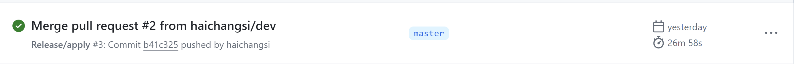
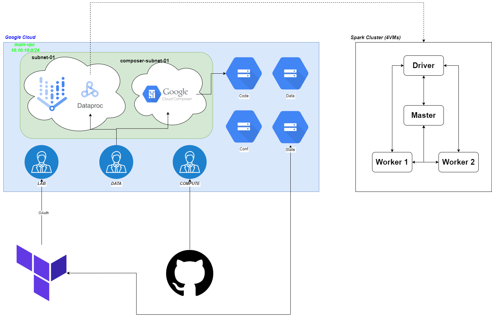

IMPORTANT ❗ ❗ ❗ Please remember to destroy all the resources after each work session. You can recreate infrastructure by creating new PR and merging it to master.


1. Authors:

   ***12***

   [Repo](https://github.com/haichangsi/WUT-TBD-PROJ1)

2. Follow all steps in README.md.

3. Select your project and set budget alerts on 5%, 25%, 50%, 80% of 50$ (in cloud console -> billing -> budget & alerts -> create buget; unclick discounts and promotions&others while creating budget).

  

5. From avaialble Github Actions select and run destroy on main branch.

7. Create new git branch and:
    1. Modify tasks-phase1.md file.

    2. Create PR from this branch to **YOUR** master and merge it to make new release.

    

8. Analyze terraform code. Play with terraform plan, terraform graph to investigate different modules.

    ***describe one selected module and put the output of terraform graph for this module here***

9. Reach YARN UI

   ***place the command you used for setting up the tunnel, the port and the screenshot of YARN UI here***

10. Draw an architecture diagram (e.g. in draw.io) that includes:
    1. VPC topology with service assignment to subnets
    There are two main subnets in current project:
    - **Subnet-01**, stated in a *./main.tf*, that is responsible for connecting the vertex_ai_workbench notebooks and dataproc services. They are both configured to default to *module.vpc.subnets[local.notebook_subnet_id].id* subnet which by default has a name declared in locals.notebook_subnet_name.
    - **composer-subnet-01**, stated in a *./modules/composer/main.tf* as a compute subnetwork is created as an encironment for Cloud Composer.
    2. Description of the components of service accounts
    There are 3 service accounts in the project.
    - **LAB** (tbd-terraform) with an address of *tbd-2024l-336368-lab@tbd-2024l-336368.iam.gserviceaccount.com* as declared in *./env/project.tfvars* is responsible for the terraform user existance, which manages all actions on behalf of terraform on the Google Cloud Platform.
    - **DATA** (tbd-composer-sa) wiwth an adress of *tbd-2024l-336368-data@tbd-2024l-336368.iam.gserviceaccount.com* has a view and edit permissions on respectively Code and Data buckets and has a permissions to edit and use Dataproc as stated in *./modules/composer/main.tf*.
    - **COMPUTE** (iac) with an adress of *{data.google_project.project.number}-compute@developer.gserviceaccount.com*. It has a Viewer access to notebook-conf bucket, it is also oresponsible for creating and distributing the Access Tokens. In *./cicd_bootstrap/main.tf* it is also indicated this service account is responsible for providing a computing power for Github operations.
    3. List of buckets for disposal
    - tbd-code-bucket (tbd-2024l-336368-code) in which are stored the code files of Airflow managed by Composer, as according to *./main.tf*
    - tbd-data-bucket (tbd-2024l-336368-data) in which are stored the files of data pipelines, accordinng to *./main.tf*
    - notebook-conf-bucket (tbd-2024l-336368-conf) in which is stored the script notebook_post_startup_script.sh, as according to the *./modules/vertex-ai-workbench/main.tf*.
    - tbd-state-bucket (tbd-2024l-336368-state) in which are stored terraform files, as according to the configuration in *./env/backend.tfvars* which is used during terraform initialization.
    4. Description of network communication (ports, why it is necessary to specify the host for the driver) of Apache Spark running from Vertex AI Workbech

    * Driver-Worker Communication:
        * The driver is responsible for coordinating the execution of Spark jobs. It communicates with the worker nodes to distribute tasks among them.
        * The driver sends task instructions to the worker nodes, which execute the tasks and return the results.
        * This communication is necessary for efficient task allocation and management across the cluster.
    * Driver-Master Communication:
        * The driver also communicates with the master node to coordinate the overall execution of Spark applications.
        * It sends heartbeat signals to the master node to indicate its status and receive instructions for task scheduling and resource allocation.
        * This communication ensures that the cluster resources are utilized optimally and tasks are executed in a coordinated manner.
    * Worker-Worker Communication:
        * Worker nodes might also communicate with each other for data exchange or coordination, depending on the specific tasks and data processing requirements.
        * This communication enables distributed data processing and sharing of intermediate results among worker nodes.
    * Block Manager Communication:
        * The block manager, responsible for managing distributed data blocks, listens on port 30001.
        * This communication facilitates the storage and retrieval of data blocks across the cluster, ensuring efficient data processing and fault tolerance.

It is necessary to specify the host for the driver because the driver initiates communication with other nodes in the cluster.
By specifying the host, you ensure that the driver knows where to send task instructions and where to listen for responses.
In the given scenario, specifying the host for the driver (which is listening on port 30000) ensures that it can communicate effectively with the worker nodes and the master node on the same subnet (10.10.10.0/24).
Without specifying the host, the driver might encounter difficulties in locating and communicating with the necessary components of the Spark cluster, leading to execution errors or inefficiencies.



    ***place your diagram here***

11. Create a new PR and add costs by entering the expected consumption into Infracost
For all the resources of type: `google_artifact_registry`, `google_storage_bucket`, `google_service_networking_connection`
create a sample usage profiles and add it to the Infracost task in CI/CD pipeline. Usage file [example](https://github.com/infracost/infracost/blob/master/infracost-usage-example.yml)

Except below, the flag --usage-file was required in *pull-request.yml* on task Generate Infracost cost estimate baseline. All the numbers in configuration are made up.

   ```.yaml
   version: 0.1
resource_type_default_usage:
  google_artifact_registry_repository.my_artifact_registry:
    storage_gb: 100 # Total data stored in the repository in GB
    monthly_egress_data_transfer_gb: # Monthly data delivered from the artifact registry repository in GB. You can specify any number of Google Cloud regions below, replacing - for _ e.g.:
      europe_north1: 50 # GB of data delivered from the artifact registry to europe-north1.
      europe_west3: 50 # GB of data delivered from the artifact registry to europe-west3.
  google_storage_bucket:
    storage_gb: 50 # Total size of bucket in GB.
    monthly_class_a_operations: 10000 # Monthly number of class A operations (object adds, bucket/object list).
    monthly_class_b_operations: 1000000 # Monthly number of class B operations (object gets, retrieve bucket/object metadata).
    monthly_data_retrieval_gb: 30 # Monthly amount of data retrieved in GB.
    monthly_egress_data_transfer_gb:
      same_continent: 20.0 # Same continent.
      worldwide: 0.0 # Worldwide excluding Asia, Australia.
      asia: 0.0 # Asia excluding China, but including Hong Kong.
      china: 0.0 # China excluding Hong Kong.
      australia: 0.0 # Australia.
  google_service_networking_connection.my_connection:
    monthly_egress_data_transfer_gb: # Monthly VM-VM data transfer from VPN gateway to the following, in GB:
      same_region: 50                # VMs in the same Google Cloud region.
      us_or_canada: 0                 # From a Google Cloud region in the US or Canada to another Google Cloud region in the US or Canada.
      europe: 50                      # Between Google Cloud regions within Europe.
      asia: 0                        # Between Google Cloud regions within Asia.
      south_america: 0              # Between Google Cloud regions within South America.
      oceania: 0                     # Indonesia and Oceania to/from any Google Cloud region.
      worldwide: 0                  # to a Google Cloud region on another continent.
   ```

   

11. Create a BigQuery dataset and an external table using SQL

    Necessary steps to run a BQ is to first run the spark job, which creates *.orc files that are necessary to run the query provided in README.md.

    ```.sql
    CREATE SCHEMA IF NOT EXISTS demo OPTIONS(location = 'europe-west1');

    CREATE OR REPLACE EXTERNAL TABLE demo.shakespeare
    OPTIONS (

    format = 'ORC',
    uris = ['gs://tbd-2024l-336368-data/data/shakespeare/*.orc']);


    SELECT * FROM demo.shakespeare ORDER BY sum_word_count DESC LIMIT 5;
    ```

    ***why does ORC not require a table schema?***
    ORC is a data format designed for Hadoop, supporting column storage format. For the optimization purposes, it also includes informations on the table schema and indexes in form digestible by most of the Big Data systems.

12. Start an interactive session from Vertex AI workbench:

    ***place the screenshot of notebook here***

13. Find and correct the error in spark-job.py

    The errors can be find by accessing the panel Dataproc->Jobs on the Google Cloud Platform by opening logs of basically any spark job that has finished with an error. It can be observed the error is as follows:
    ```
    Traceback (most recent call last):
    File "/tmp/ec05e5a2-0a9c-457d-9449-4303d369f5c3/spark-job.py", line 42, in <module>
        df.write.mode("overwrite").orc(DATA_BUCKET)
    File "/usr/lib/spark/python/lib/pyspark.zip/pyspark/sql/readwriter.py", line 1286, in orc
    File "/usr/lib/spark/python/lib/py4j-0.10.9.5-src.zip/py4j/java_gateway.py", line 1321, in __call__
    File "/usr/lib/spark/python/lib/pyspark.zip/pyspark/sql/utils.py", line 190, in deco
    File "/usr/lib/spark/python/lib/py4j-0.10.9.5-src.zip/py4j/protocol.py", line 326, in get_return_value
    py4j.protocol.Py4JJavaError: An error occurred while calling o88.orc.
    : com.google.cloud.hadoop.repackaged.gcs.com.google.api.client.googleapis.json.GoogleJsonResponseException: 404 Not Found
    POST https://storage.googleapis.com/upload/storage/v1/b/tbd-2024l-9910-data/o?ifGenerationMatch=0&uploadType=multipart
    {
    "code" : 404,
    "errors" : [ {
        "domain" : "global",
        "message" : "The specified bucket does not exist.",
        "reason" : "notFound"
    } ],
    "message" : "The specified bucket does not exist."
    }
    ```

This information led to the bucket configuration of spark job in *modules/data-pipeline/resources/spark-job.py*, where the main global DATA_BUCKET variable was set to use bucket with hard-coded name. The format was similar, but the index number (being a variable of the project) was different. After changing to "gs://tbd-2024l-336368-data/data/shakespeare/", the job has been able to run properly.

    ***describe the cause and how to find the error***

14. Additional tasks using Terraform:

    1. Add support for arbitrary machine types and worker nodes for a Dataproc cluster and JupyterLab instance

    ***place the link to the modified file and inserted terraform code***

    3. Add support for preemptible/spot instances in a Dataproc cluster

    ***place the link to the modified file and inserted terraform code***

    3. Perform additional hardening of Jupyterlab environment, i.e. disable sudo access and enable secure boot

    ***place the link to the modified file and inserted terraform code***

    4. (Optional) Get access to Apache Spark WebUI

    ***place the link to the modified file and inserted terraform code***
